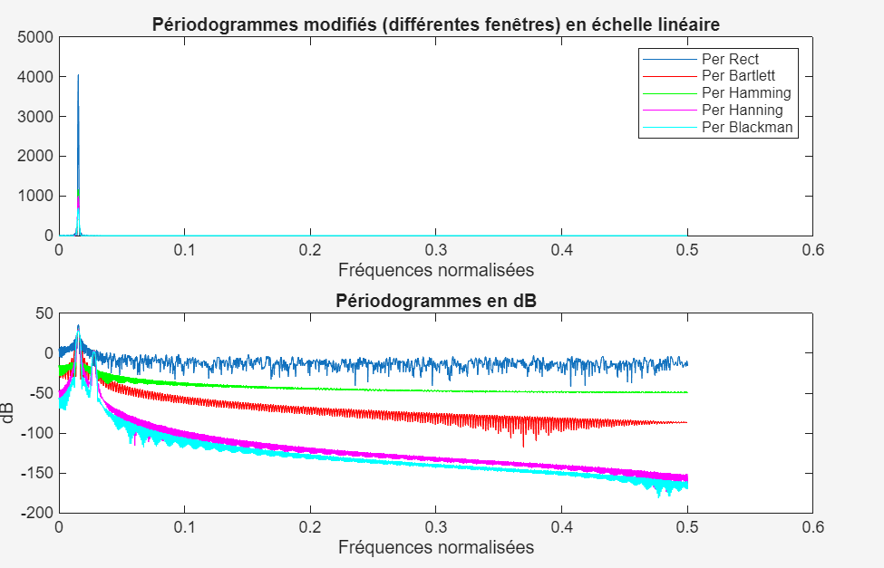

# Traitement_de_signal
Implémentation MATLAB pour l'analyse spectrale de signaux bruités et le filtrage numérique d'un signal réel.

Travaux Pratiques : Traitement Numérique du Signal (TNS) - Analyse Spectrale

Ce dépôt contient les travaux pratiques de Traitement Numérique du Signal (TNS) réalisés à l'ENSEEIHT, axés sur l'analyse spectrale et le filtrage numérique. 

##  Description du Projet

Ce projet a pour but de mettre en pratique les concepts théoriques de traitement du signal :
- **Partie 1 :** Analyse spectrale d'un signal sinusoïdal bruité, en testant différents paramètres et méthodes d'estimation spectrale (périodogramme, méthode de Welch, etc.).

  
- **Partie 4 :** Application sur un signal réel. Analyse spectrale et filtrage numérique d'un signal issu d'un ventilateur (fréquence d'échantillonnage de 5120 Hz).

##  Structure du Dépôt

- `GroupeE-H_Ennedoui_Khalloufi_TNS_TP1_AnalyseSpectrale.m` : Script principal complété pour le TP1.
- `GroupeE-H_Ennedoui_Khalloufi_TNS_TP4_AnalyseSpectrale.m` : Script principal pour le TP4, dédié à l'analyse et au filtrage du signal réel.
- `ventilateur_Fe_5120Hz.txt` : Données du signal réel utilisé pour le TP4 (enregistrements d'un ventilateur échantillonnés à 5120 Hz).
- `filtnum.m` : Fonction MATLAB utilitaire pour visualiser et appliquer des filtres numériques.
- `coefs.mat` : Fichier de données MATLAB contenant des coefficients de filtres.

## Utilisation

Ces scripts sont conçus pour être exécutés sous **MATLAB**.

1. Clonez ce dépôt sur votre machine locale.
2. Ouvrez MATLAB et définissez le dossier cloné comme répertoire de travail courant.
3. Exécutez directement les scripts `GroupeE-H_Ennedoui_Khalloufi_TNS_TP1_AnalyseSpectrale.m` ou `GroupeE-H_Ennedoui_Khalloufi_TNS_TP4_AnalyseSpectrale.m`.
4. Assurez-vous que les fichiers de données annexes (`ventilateur_Fe_5120Hz.txt`, `filtnum.m`, `coefs.mat`) sont bien présents dans le même répertoire pour garantir la bonne exécution des analyses.

##  Auteurs

- **Imane Khalloufi** - **Ennedoui**

---
*Projet réalisé dans le cadre des enseignements du département 3EA à l'ENSEEIHT.*
